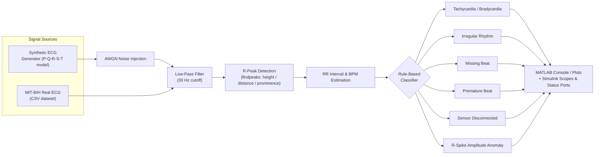

# ❤️‍🩹 Real-Time ECG Anomaly Detection using Rule-Based Signal Processing

<p align="center">
  
  
  
  
</p>

<p align="center">
  <b>A MATLAB &amp; Simulink pipeline that generates, filters, and analyzes ECG signals in real time,</b><br/>
  <b>flagging arrhythmias with transparent, clinically-inspired rule-based logic — validated on the MIT-BIH Arrhythmia Database.</b>
</p>

---

## 📑 Table of Contents

1. [Overview](#-overview)
2. [System Architecture](#-system-architecture)
3. [Key Features](#-key-features)
4. [Repository Structure](#-repository-structure)
5. [Detection Rules & Thresholds](#-detection-rules--thresholds)
6. [MATLAB Scripts Reference](#-matlab-scripts-reference)
7. [Simulink Real-Time Model](#-simulink-real-time-model)
8. [Dataset](#-dataset)
9. [Screenshots & Results](#-screenshots--results)
10. [Video Demonstration](#-video-demonstration)
11. [Getting Started](#-getting-started)
12. [Validation & Known Limitations](#-validation--known-limitations)
13. [Future Work](#-future-work)
14. [References](#-references)
15. [Author & Credits](#-author--credits)

---

## 🔬 Overview

This project implements an **embedded biomedical signal-processing chain** for real-time ECG (electrocardiogram) monitoring and arrhythmia screening. Unlike black-box machine-learning classifiers, the anomaly detector here is built entirely from **explainable, rule-based heuristics** derived from clinical heart-rate conventions (BPM thresholds, RR-interval variability, R-wave morphology) — making every decision traceable, which is a key requirement for embedded medical-device prototyping and coursework in biomedical instrumentation.

The system is implemented twice, in parallel, to bridge algorithm design and embedded deployment:

- **MATLAB scripts** — for rapid prototyping, synthetic signal generation, filter design, frequency-domain analysis, and validation against real patient data.
- **A Simulink model** — a block-diagram equivalent of the MATLAB logic (`MATLAB Function` block + scopes + workspace I/O), representing the step toward real-time / hardware-in-the-loop embedded execution.

The pipeline is exercised on two data sources:

| Source | Purpose |
|---|---|
| 🧪 **Synthetic ECG generator** | A parametric P‑Q‑R‑S‑T waveform model with injected Gaussian noise, used to unit-test filtering and detection logic under controlled conditions |
| 🫀 **MIT-BIH Arrhythmia Dataset** | Real, clinically-labeled ECG heartbeats used to validate the rule-based detector against ground truth |

---

## 🏗 System Architecture



The **same decision logic** is mirrored between `Scripts/real_ecg_test.m` (MATLAB) and `Simulink_models/real_time_ecg.slx` (Simulink `MATLAB Function` block), with `ecg_ts`, `ECG_max_amp`, and `mean_RR_init` exported from the MATLAB base workspace to seed and synchronize the Simulink simulation — a common pattern for moving an algorithm from desktop prototype toward an embedded/real-time target.

---

## ✨ Key Features

| Module | Description |
|---|---|
| 🫀 **Synthetic ECG Generation** | Gaussian-sum model of the P, Q, R, S, T waves, tiled over a repeating cardiac cycle |
| 🎛 **Noise Simulation** | Additive white Gaussian noise (AWGN) to emulate electrode/motion artifacts |
| 🧹 **Filtering** | 30 Hz low-pass (Butterworth-based `lowpass`) filtering; benchmarked against a moving-average filter |
| 📈 **Frequency-Domain Analysis** | FFT comparison of noisy vs. filtered signal spectra |
| 📍 **R-Peak Detection** | Adaptive `findpeaks`-based detection (height / distance / prominence tuned to signal amplitude) |
| ❤️ **Heart Rate Estimation** | RR-interval extraction and BPM computation |
| ⚠️ **Rule-Based Arrhythmia Classification** | Tachycardia, Bradycardia, Irregular Rhythm, Missing Beat, Premature Beat, Sensor Disconnection, Abnormal R-spike |
| 🩺 **Real-Patient Validation** | Cross-checked against the MIT-BIH Arrhythmia Database (5-class labels) |
| 🔌 **Simulink Embedded Model** | Block-diagram equivalent of the detection logic with live scopes and status output ports, structured for hardware/embedded deployment |

---

## 📁 Repository Structure

```
embedded_biomedical_project/
│
├── Scripts/                        # MATLAB source code
│   ├── main_ecg_system.m           # Top-level pipeline on synthetic ECG
│   ├── generate_signal.m           # Synthetic P-Q-R-S-T waveform generator
│   ├── noise_signal.m              # AWGN noise injection
│   ├── filtered_signal.m           # 30 Hz low-pass filter
│   ├── peak_detection.m            # R-peak (findpeaks) detector
│   ├── threshold_detection.m       # Static-threshold anomaly flag
│   ├── filter_comparison.m         # Low-pass vs. moving-average benchmark
│   ├── fft_practice.m              # FFT spectral analysis
│   ├── real_ecg_test.m             # Full validation pipeline on MIT-BIH data + Simulink handoff
│   ├── signal_practice.m           # Learning / sandbox script
│   └── filtering_practice.m        # Learning / sandbox script
│
├── Simulink_models/
│   └── real_time_ecg.slx           # Real-time rule-based ECG classifier (Simulink)
│
├── ECG_dataset/
│   ├── mitbih_train.csv.zip        # MIT-BIH training set (compressed, version-controlled)
│   └── mitbih_folder/
│       └── mitbih_train.csv        # Extracted CSV (git-ignored — extract locally before use)
│
├── Screenshots/                    # Result figures referenced in this README
│
├── Results/
│   └── recording of project run.mp4  # Full walkthrough / demo recording
│
└── README.md
```

---

## 🧠 Detection Rules & Thresholds

All classification logic is intentionally **transparent and deterministic** — every flag can be traced back to a single interpretable condition, evaluated over the RR-interval series and detected R-peak amplitudes.

| Condition | Rule | Clinical Rationale |
|---|---|---|
| 🔴 **Tachycardia** | `BPM > 100` | Elevated heart rate |
| 🔵 **Bradycardia** | `BPM < 55` | Depressed heart rate |
| 🟡 **Irregular Rhythm** | `std(RR) ≥ 0.1 s` | High beat-to-beat timing variability |
| ⚪ **Missing Beat** | `RR > 1.5 × mean(RR)` | An RR gap far larger than the average cycle |
| 🟠 **Premature Beat** | `RR < 0.8 × mean(RR)` (single) / ≥ 2 consecutive → **repeated premature beats** | Early depolarization pattern |
| ⚫ **Sensor Disconnected** | `max(abs(filtered signal)) < 0.1` | Flat-lined / near-zero amplitude signal |
| 🟣 **Abnormal R-Spike (high)** | `max(peaks) > 1.5 × mean(peaks)` | Unusually large R-wave relative to the record |
| 🟣 **Abnormal R-Spike (weak)** | `min(peaks) < 0.5 × mean(peaks)` | Unusually weak/undetected R-wave |

> Thresholds (100 / 55 BPM, 0.1 s std-dev, 1.5×/0.8× RR ratios) follow standard clinical heart-rate conventions and were tuned empirically against the synthetic and MIT-BIH signals used in this project.

---

## 📜 MATLAB Scripts Reference

| File | Role |
|---|---|
| **`main_ecg_system.m`** | End-to-end pipeline on the **synthetic** signal: generate → add noise → filter → detect R-peaks → classify → plot 5-panel summary |
| **`generate_signal.m`** | Builds one ECG cycle from Gaussian P/Q/R/S/T components and tiles it across the time vector |
| **`noise_signal.m`** | Adds AWGN (`0.5·randn`) to emulate real-world sensor noise |
| **`filtered_signal.m`** | Applies a 30 Hz low-pass filter at `fs = 1000 Hz` |
| **`peak_detection.m`** | Wraps `findpeaks` with tuned height/distance/prominence for R-wave detection |
| **`threshold_detection.m`** | Simple static-amplitude anomaly flag (`filtered > 1.5`) |
| **`filter_comparison.m`** | Benchmarks a moving-average filter against the low-pass filter on peak count, RR intervals, and BPM accuracy |
| **`fft_practice.m`** | Plots the FFT spectrum of the noisy vs. filtered signal to visualize noise attenuation |
| **`real_ecg_test.m`** | The **primary validation script** — loads real MIT-BIH rows, filters, detects peaks with an *adaptive* threshold (scaled to signal amplitude), classifies rhythm, and exports `ecg_ts`, `ECG_max_amp`, and `mean_RR_init` to the base workspace for the Simulink model |
| **`signal_practice.m`**, **`filtering_practice.m`** | Exploratory scripts used while developing the signal-generation and filtering approach |

---

## 🔌 Simulink Real-Time Model

**`Simulink_models/real_time_ecg.slx`** re-implements the rule-based classifier as a block diagram, intended as the bridge toward hardware/real-time deployment.

<p align="center">
  
</p>

**Signal flow:**

| Block | Function |
|---|---|
| `ecg_ts` (**From Workspace**) | Streams the filtered ECG `timeseries` exported by `real_ecg_test.m` |
| `-C-` (**Constant**, `ECG_max_amp`) | Supplies the adaptive amplitude reference used for peak thresholds, kept identical to the MATLAB script |
| `Scope 1` | Raw streamed ECG input |
| **Function Block** (`fcn`) | MATLAB Function block containing the ported rule-based classifier (BPM, status, missing/premature/R-condition/sensor flags) |
| `Scope` | Live BPM trace |
| `out.status_out`, `out.missing_out`, `out.premature_out`, `out.r_condition_out`, `out.sensor_out` | Individual **To Workspace** logging ports for each anomaly category, enabling post-run inspection and comparison against the MATLAB reference output |

---

## 🫀 Dataset

This project validates its detector against the **MIT-BIH Arrhythmia Database** (`ECG_dataset/mitbih_folder/mitbih_train.csv`), a widely used benchmark in ECG research.

| Property | Detail |
|---|---|
| Format | CSV, 188 columns per row |
| Columns 1–187 | Zero-padded heartbeat waveform segment |
| Column 188 | Class label |
| Sampling rate used | 125 Hz (per-segment, as provided by the dataset) |

**Class labels:**

| Label | Class |
|---|---|
| `0` | Normal |
| `1` | Supraventricular ectopic beat (S) |
| `2` | Ventricular ectopic beat (V) |
| `3` | Fusion beat (F) |
| `4` | Unknown / Paced beat (Q) |

> The raw CSV is git-ignored due to size; only the compressed `mitbih_train.csv.zip` is version-controlled. Extract it to `ECG_dataset/mitbih_folder/mitbih_train.csv` before running `real_ecg_test.m` (see [Getting Started](#-getting-started)).

---

## 🖼 Screenshots & Results

### 1️⃣ Simulink Model & Synthetic Pipeline

<table>
<tr>
<td width="50%" align="center">
<br/>
<b>Fig. 1</b> — Simulink real-time classifier block diagram
</td>
<td width="50%" align="center">
<br/>
<b>Fig. 2</b> — Raw → filtered → R-peak-annotated ECG (real MIT-BIH segment)
</td>
</tr>
</table>

### 2️⃣ Correctly Classified Rhythms

<table>
<tr>
<td width="33%" align="center">
<br/>
<b>Fig. 3</b> — Normal sinus rhythm BPM scope
</td>
<td width="33%" align="center">
<br/>
<b>Fig. 4</b> — Tachycardia correctly flagged on BPM scope
</td>
<td width="33%" align="center">
<br/>
<b>Fig. 5</b> — Premature-beat pattern on BPM scope
</td>
</tr>
</table>

### 3️⃣ Edge Cases: Tachycardia Label Mismatches

<table>
<tr>
<td width="33%" align="center">
<br/>
<b>Fig. 6</b> — BPM scope: detector flags tachycardia on a dataset row labeled "Normal"
</td>
<td width="33%" align="center">
<br/>
<b>Fig. 7</b> — Command-window trace, part 1
</td>
<td width="33%" align="center">
<br/>
<b>Fig. 8</b> — Command-window trace, part 2
</td>
</tr>
</table>

### 4️⃣ Edge Cases: Bradycardia Label Mismatches

<table>
<tr>
<td width="33%" align="center">
<br/>
<b>Fig. 9</b> — BPM scope showing bradycardia mismatch
</td>
<td width="33%" align="center">
<br/>
<b>Fig. 10</b> — Corresponding ECG waveform
</td>
<td width="33%" align="center">
<br/>
<b>Fig. 11</b> — Command-window trace, part 1
</td>
</tr>
<tr>
<td width="33%" align="center">
<br/>
<b>Fig. 12</b> — Command-window trace, part 2
</td>
<td width="33%" align="center">
<br/>
<b>Fig. 13</b> — Command-window trace, part 3
</td>
<td width="33%"></td>
</tr>
</table>

*(See [Validation & Known Limitations](#-validation--known-limitations) for why these "mismatch" cases occur and what they reveal about rule-based detection.)*

---

## 🎥 Video Demonstration

A full walkthrough of the project — synthetic pipeline, MIT-BIH validation, and the Simulink model running live — is available in [`Results/recording of project run.mp4`](<Results/recording of project run.mp4>).

<p align="center">
<a href="<Results/recording of project run.mp4>">
  
  <br/>
  <b>▶ Click to watch the full demo recording</b>
</a>
</p>

> GitHub does not always render inline video playback for repository-relative files — if the player above doesn't load, open [`Results/recording of project run.mp4`](<Results/recording of project run.mp4>) directly or clone the repo and play it locally.

---

## 🚀 Getting Started

### Prerequisites

| Requirement | Notes |
|---|---|
| MATLAB (R2021b or later recommended) | Core scripting environment |
| **Signal Processing Toolbox** | Required for `lowpass`, `findpeaks` |
| **Simulink** | Required to open/run `real_time_ecg.slx` |

### Run the synthetic pipeline

```matlab
% In MATLAB, from the Scripts/ folder:
main_ecg_system
```
This generates a synthetic ECG, adds noise, filters it, detects R-peaks, classifies the rhythm, and plots a 5-panel summary figure.

### Run filter / frequency analysis demos

```matlab
filter_comparison   % Low-pass vs. moving-average filter benchmark
fft_practice         % FFT spectrum before/after filtering
```

### Validate against real ECG data + drive the Simulink model

1. Extract `ECG_dataset/mitbih_train.csv.zip` to `ECG_dataset/mitbih_folder/mitbih_train.csv` (update the path in `real_ecg_test.m` if your working directory differs).
2. Run the validation script — this populates the base workspace with `ecg_ts`, `ECG_max_amp`, and `mean_RR_init`, and prints the full rule-based classification report:
   ```matlab
   real_ecg_test
   ```
3. Open `Simulink_models/real_time_ecg.slx`.
4. Press **Run**. The model consumes `ecg_ts`/`ECG_max_amp` from the base workspace and reproduces the same classification live on its scopes and `out.*` logging ports.

---

## 🧪 Validation & Known Limitations

Testing `real_ecg_test.m` against randomly sampled MIT-BIH segments surfaced a valuable and honestly-reported edge case, documented in Figs. 6–13:

- On **short signal windows** (as few as 3–5 detected R-peaks per sample), a handful of RR intervals is enough to swing the mean BPM estimate significantly. A dataset row labeled **"Normal" (class 0)** can still register a mean BPM above 100 or below 55 purely from local timing variance — triggering a **Tachycardia/Bradycardia mismatch** against the ground-truth label.
- This is an expected consequence of **static, global thresholds applied to very short observation windows**, not a bug in the peak-detection or filtering stages (Fig. 2 shows R-peaks are being located correctly).
- It highlights a core trade-off of rule-based biomedical detection: **thresholds that are simple and fully explainable are also less robust to short/noisy windows** than a model that can learn context — motivating the future work below.

**Other current limitations:**
- The synthetic waveform model (`generate_signal.m`) is a simplified Gaussian approximation of the PQRST complex, not a physiologically validated ECG simulator.
- Detection thresholds are fixed constants tuned on the datasets used here; they are not adaptive across patients or lead configurations.
- The Simulink model expects a fixed sample rate matched to the exported `ecg_ts`/`ECG_max_amp` pair and is not yet interfaced to physical acquisition hardware (ADC/DAQ).

---

## 🔭 Future Work

- Adaptive / learning-based thresholding to reduce short-window misclassification.
- Hardware-in-the-loop testing with a physical ECG front-end (e.g., AD8232) via Simulink Support Package for embedded targets.
- Expansion of the rule set to detect additional arrhythmia classes present in the MIT-BIH label set (S, V, F, Q).
- Automated confusion-matrix style reporting of rule-based classification vs. MIT-BIH ground-truth labels across the full dataset (rather than random sampling).

---

## 📚 References

- Moody, G. B., & Mark, R. G. (2001). *The impact of the MIT-BIH Arrhythmia Database.* IEEE Engineering in Medicine and Biology Magazine, 20(3), 45–50.
- Goldberger, A. L., et al. (2000). *PhysioBank, PhysioToolkit, and PhysioNet: Components of a new research resource for complex physiologic signals.* Circulation, 101(23), e215–e220. [https://physionet.org](https://physionet.org)

---

## 👤 Author & Credits

<p align="center">
<b>Dev Soni</b><br/>
Biomedical Signal Processing · MATLAB &amp; Simulink Embedded Systems
</p>

<p align="center">
This project — including all MATLAB scripts, the Simulink model, signal-processing logic, dataset validation, and documentation — was designed and developed solely by <b>Dev Soni</b>.
</p>

---

<p align="center"><i>For academic and research demonstration purposes.</i></p>
